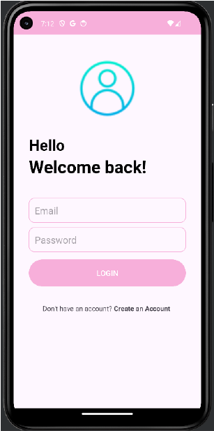

# MyNotes App

## **Overview**
MyNotes App is a digital notebook designed for seamless note management. Users can securely create, edit, and delete notes in real time. The app uses Firebase for user authentication and Firestore for database management.

---

## **Author**
**Elif Sena Daldal**

---

## **Demo**
[Try the MyNotes App Demo](https://appetize.io/app/cerna4fkfrvbl545am5hfnfnxq?device=pixel7&osVersion=13.0)

---

## **Key Features**
- **User Authentication**: Secure registration and login via Firebase.
- **Real-Time Note Management**: Notes are updated instantly across devices.
- **Sorting**: Notes are displayed by timestamp in descending order.
- **Logout**: Secure logout option available.

---

## **Technologies Used**
- **Android Studio**: App development.
- **Firebase Authentication**: Secure login and registration.
- **Firestore**: Real-time database functionality.

---

## **User Interface (UI) Screens**
- **Sign Up Screen**  
  
- **Login Screen**  
  
- **Home Screen**  
  
- **Add Note Screen**  
  
- **Edit & Delete Note Screen**  
  
---

## **Database Design**
- **Firestore**: Each user has a unique UserId, and each note is stored with a unique NoteId.

---

## **How to Use MyNotes App**
1. **Sign Up/Login**: Create an account or log in using:
   - Email: `test@gmail.com`
   - Password: `123test`
2. **Verify Email**: Check your email and verify your account.
3. **Add Note**: Click the “+” button to create a new note.
4. **Edit/Delete Note**: Tap on an existing note to edit or delete.
5. **Logout**: Click the menu button in the top-right corner to log out.

---

## **References**
- [Firebase Documentation](https://firebase.google.com/docs/android/setup?hl=tr)
- [Android RecyclerView](https://developer.android.com/develop/ui/views/layout/recyclerview?hl=tr)
- [ChatGPT](https://chat.openai.com/)

